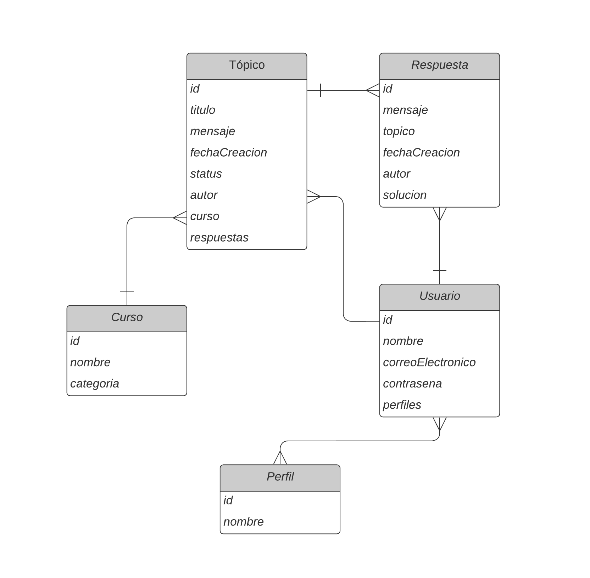

# Foro hub
[Read in English](README.en.md) | [Leer en Español](README.es.md)

 

This back-end API REST application performs the activities in a forum. It allows you to subscribe with your name, email and password and then use the forum in the normal way.

## Project description
This application was carried out as part of the training in Oracle Next Eucation (ONE) and Alura Latam, using Spring Boot, MySQL and Security using the STATELESS form of authentication with JWT (JSON Web Token).

The documentation was prepared with Swagger and can be used when you run the program.

### MySQL Database Diagram

### Dependencies used (the pom.xml file)
- pring-boot-starter-web:3.0.2
- spring-boot-devtools:3.0.2
- lombok:1.18.24
- spring-boot-starter-test:3.0.2
- spring-boot-starter-data-jpa:3.0.2
- flyway-core:9.5.1
- flyway-mysql:9.5.1
- mysql-connector-j:8.0.32
- spring-boot-starter-validation:3.0.2
- spring-boot-starter-security:3.0.2
- java-jwt:4.2.1
- springdoc-openapi-starter-webmvc-ui

## View the documentation and use the application

1. Download all files and folders to one folder on your computer.
 - you can do this using the console or by clicking the green "Code" button in the GitHub repository and choosing Download ZIP

2. Install MySQL on your computer and create the database with the name forohub.

3. Open the project in IntelliJ

4. Define the following environment variables in your operating system (Windows or Mac):
 - SQL_USERNAME --> your username to enter MySQL
 - SQL_PASSWORD --> your password to enter MySQL
 - JWT_SECRET --> your password for authorization with JWT

 If the compiler does not accept the variables, also define them in IntelliJ (Run/Edit Configurations/Environment variables)

 The program will run on localhost:8080.

5. Run the ForohubApplication class.

6. With the first run, the six tables in the database were built.

7. Now you can view the documentation
 - at http://localhost:8080/v3/api-docs you can see the code system
 - at http://localhost:8080/swagger-ui/index.html you are presented with all the CRUDs and data formats

8. To start you need to include an administrator directly in the database. You can use WorkBench IDE or the command line. I recommend this process:

 - Into the profiles table include two basic profiles:
    - USER
    - ADMINISTRADOR

 - In swagger-ui/index.html do POST on usuarios/inscripcion. Enter nnombre (name), login (email) and clave (password). The first user will be registered in the users table.

 - append the ADMINISTRATOR profile to this user in WorkBench - in the usuario_roles table appends a line with the user id and the ADMINISTRADOR profile id.

9. Now you can examine all the possibilities in swagger. For almost all the options you need to register in login and obtain a JWT that you copy at the top in the authorize button.

## Technologies used
- Java SE17
- Spring Boot v.3.0.2
- IDE IntelliJ
- MySQL of Oracle
- OpenAPI swagger
- Editor de Visual Studio Code for this README

## Project status
The project is finished.

## License
GNU General Public License v3.0