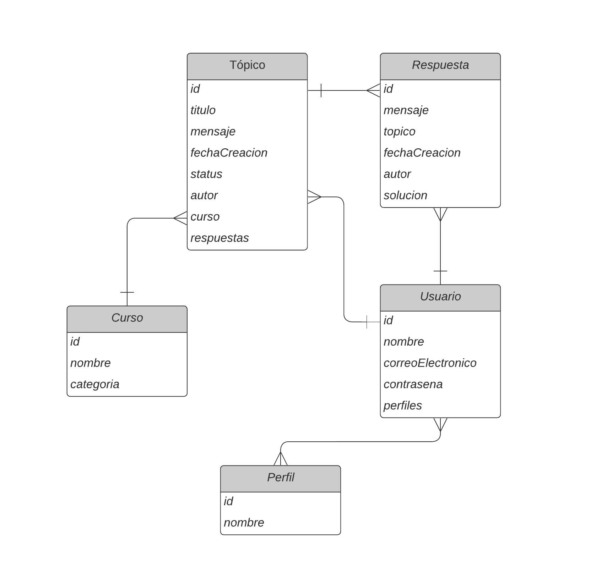

# Foro hub

 

Esta aplicación API de back-end realiza las actividades en un foro. Te permite suscribirte con tu nombre, email y contraseña y después usar el foro en la forma comun.

## Descripción del proyecto
Esta aplicación se realizó como parte de la formación en Oracle Next Eucation (ONE) y Alura Latam, usando Spring Boot, MySQL y Security usando la forma STATELESS de autenticación con JWT (JSON Web Token).

La documentación se preparó con Swagger y se puede realizar cuando activas el programa.

### Diagrama de base de datos MySQL

### Dependencias usadas (el archivo pom.xml)
- pring-boot-starter-web:3.0.2
- spring-boot-devtools:3.0.2
- lombok:1.18.24
- spring-boot-starter-test:3.0.2
- spring-boot-starter-data-jpa:3.0.2
- flyway-core:9.5.1
- flyway-mysql:9.5.1
- mysql-connector-j:8.0.32
- spring-boot-starter-validation:3.0.2
- spring-boot-starter-security:3.0.2
- java-jwt:4.2.1
- springdoc-openapi-starter-webmvc-ui

## Visualizar la documentación y usar la aplicación

1. Descarga todos los archivos y carpetas en una carpeta en tu computadora.
    - esto puedes hacer usando la consola o precionando boton verde "Code" en el repositorio de GitHub y escoges Download ZIP

2. Instala MySQL en tu computadora y crea la base de datos con el nombre forohub.

3. Abre el proyecto en IntelliJ 

4. Define las siguientes variables de entorno en tu sistema operativo (Windows o Mac):
    - SQL_USERNAME --> tu username para entrar en MySQL 
    - SQL_PASSWORD --> tu contraseña para entrar en MySQL
    - JWT_SECRET --> tu password para la autorización con JWT

    Si el complilador no acepta las variables, defínelas también en IntelliJ (Run/Edit Configurations/Environment variables)

    El programa se ejecutará en localhost:8080.

5. Run la clase DesafioLiteraluraApplication. 

6. Con primer run se te construyeron las dos tablas en la base de datos. 

7. Ahora puedes visualizar la documentación
    - en http://localhost:8080/v3/api-docs puedes ver el sistema del código
    - en http://localhost:8080/swagger-ui/index.html se te presentan todos los CRUDs y formatos de datos

7. Descarga un cliente de API, te recomiendo Insomnia.

8. En Insomnia puedes realizar las actividades mencionadas en swagger
    

## Tecnologías usadas
- Java SE17
- Spring Boot v.3.0.2
- IDE IntelliJ
- Cliente de API Insomnia
- MySQL de Oracle
- OpenAPI swagger
- Editor de Visual Studio Code para este README

## Estado del proyecto
El proyecto está terminado.

## Licencia
GNU General Public License v3.0